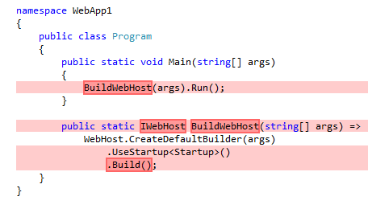
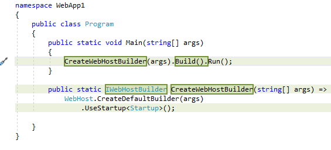

# Migrate from ASP.NET Core 2.0 to 2.1

By [Rick Anderson](https://twitter.com/RickAndMSFT)

This article covers the basics of migrating an ASP.NET Core 2.0 app to 2.1.

A quick way to get an overview of the changes in 2.1 is to:

* Create an ASP.NET Core 2.0 web app named WebApp1.
* Commit the WebApp1 in a source control system.
* Delete WebApp1 and create an ASP.NET Core 2.1 web app named WebApp1 in the same place.
* Review the changes in the 2.1 version.

## Update the project file to use 2.1 versions

Update the project *.csproj* file:

* Change `<TargetFramework>netcoreapp2.0</TargetFramework>` to the 2.1 version, that is `<TargetFramework>netcoreapp2.1</TargetFramework>`.
* Replace the version specified "Microsoft.AspNetCore.All"  package reference with the versionless "Microsoft.AspNetCore.App" package reference. See [Migrating from Microsoft.AspNetCore.All to Microsoft.AspNetCore.App](xref:fundamentals/metapackage#migrate) and [Microsoft.AspNetCore.App metapackage](xref:fundamentals/metapackage-app).
* Remove all references to `<DotNetCliToolReference>` elements for "Microsoft.AspNetCore", "Microsoft.VisualStudio", and "Microsoft.EntityFrameworkCore" packages. These tools have been replaced by global tools.
* Remove the `<DotNetCliToolReference>` elements for any "Microsoft.AspNetCore" packages. These have been replaced by global tools.

## Changes to take advantage of the new code-based idioms that are recommended in ASP.NET Core 2.1

### Changes to Main

The following images show the changes made to the templated generated *Program.cs* file.

The preceding image shows the 2.0 version with the replacements in red.

The following image shows the 2.1 code. The code in green replaced the 2.0 version:

The following code shows the 2.1 version of *Program.cs*:

[!code-csharp[Main](20_20/sample/Program.cs?name=snippet)]

The new `Main` replace the call to `BuildWebHost` with [CreateWebHostBuilder](dotnet/api/microsoft.aspnetcore.mvc.testing.webapplicationfactory-1.createwebhostbuilder?view=aspnetcore-2.1#Microsoft_AspNetCore_Mvc_Testing_WebApplicationFactory_1_CreateWebHostBuilder). See [Set up a host](xref:fundamentals/host/web-host) for the tasks `CreateWebHostBuilder` performs.

### Changes to Startup

The following code shows the changes to 2.1 template generated code. All changes are newly added code, except that `UseBrowserLink` has been removed:

[!code-csharp[Main](20_20/sample/Startup.cs?highlight=3,4,21-26,30,37,46,48)]

The preceding code changes are detailed in:

* [GDPR support in ASP.NET Core](xref:security/gdpr) for `CookiePolicyOptions` and `UseCookiePolicy`.
* [HTTP Strict Transport Security Protocol (HSTS)](xref:security/enforcing-ssl#http-strict-transport-security-protocol-hsts) for `UseHsts`.
* [Require HTTPS](xref:security/enforcing-ssl#require-https) for `UseHttpsRedirection`.
* [SetCompatibilityVersion](xref:fundamentals/startup#setcompatibilityversion) for `SetCompatibilityVersion(CompatibilityVersion.Version_2_1)`.